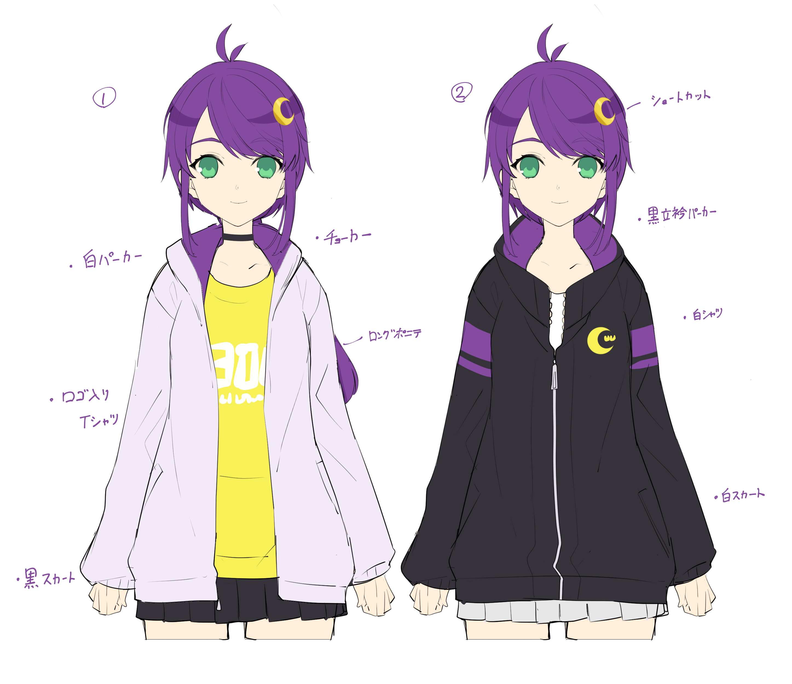

# 活動方針
億千よろずの活動方針をメモする

## 自己紹介
億を知り万を司る（ようになりたい） <ruby>億千<rp>（</rp><rt>おくち</rt><rp>）</rp></ruby>よろずです。

個人勢なので好き勝手にやっています。ぼくがこの世のルールだ。

- [Twitter @okuchi_yorozu](https://twitter.com/okuchi_yorozu)
- [YouTubeチャンネル 億千よろず](https://www.youtube.com/channel/UCpEsTR5Nnd0-HgKngIQqbmA)

### やりたいこと
- 個人勢のVtuberが生まれる手助け
- ゲーム配信（ジャンルはなんでも。好きなのはホラゲー）
- プログラミング配信（得意な言語はScalaとJavaScript/TypeScriptです）

### やっているゲーム
- FF14（漆黒のヴィランズ - ファイナルファンタジーXIV）
- Switch
- Steam
- Apex Legends™
- 雀魂 -じゃんたま-

### 好きなマンガ/アニメ
- ソードアート・オンライン
- リゼロ
- 化物語

## 目標
- [x] 配信ではじめてのコメントをもらう
- [ ] Twitterのフォロアー数 100人
- [ ] YouTubeチャンネルの登録者数 100人
- [ ] 他のVtuberさんとはじめてのコラボ
- [ ] [VNUMA](https://hiyoko.sonoj.net/)でVtuberとして認識してもらう
- [ ] 普段から遊べる友だちほしい！

## やること
- [x] Twitterアカウントを作る
- [x] Vtuberのモデルを作る
- [x] はじめての配信をする
- [ ] はじめての編集済み動画を作る
- [ ] Discordアカウントを作る
- [ ] Twitterのヘッダーを作る
- [ ] 自己紹介を考える
- [ ] Twitterで自己紹介を固定ツイートにする
- [ ] YouTubeチャンネルのヘッダーを作る
- [ ] マッマの紹介をする
- [ ] 配信のOPを作る
- [ ] 配信のEDを作る
