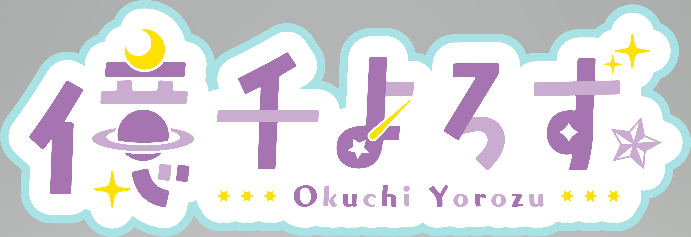

[活動方針](index.md) | [ステータス](status.md) | [目標](achievement.md) | [実績](result.md)

# 活動方針
<ruby>億千<rp>（</rp><rt>おくち</rt><rp>）</rp></ruby>よろずの活動方針メモ。<ruby>億千<rp>（</rp><rt>おくせん</rt><rp>）</rp></ruby>よろず呼びでも正しい。

## 自己紹介
億を知り万を司る天の川銀河の観測者、億千よろずです。  
地球ではどこにでもいる普通の高校生の体で生活しており、能力が制限されている。パソコンと運動が得意。  
元の能力を取り戻すために日々精進中🎋🍼

- 誕生日: 130億年前8月28日（地球では11月15日）
- 年齢: 130億1才（地球ではひみつ！）
- 性別: なし
- 身長: 156.6cm
- 体重: 21g

## リンク
- [Twitter: @okuchi_yorozu](https://twitter.com/okuchi_yorozu)
- [YouTubeチャンネル: 億千よろず](https://www.youtube.com/c/okuchiyorozu)
- Discord: 億千よろず#0998
- [ましゅまろ](https://marshmallow-qa.com/okuchi_yorozu)
- [欲しいもの](https://www.amazon.jp/hz/wishlist/ls/1ZG5GLS0DCPCL?ref_=wl_share)
- [GitHub](https://github.com/okuchi-yorozu)

by 0012ママ

by 雨沢玲里姉さん

### やりたいこと
- 個人勢のVtuberが生まれる手助け
- 考えをまとめたりする際に使う便利フレームワークの紹介
- ゲーム実況（ジャンルはなんでも。好きなのはホラゲー）
- 視聴者参加型ゲーム配信
- プログラミング配信（得意な言語はScalaとTypeScriptです）

### やっているゲーム
- FF14（漆黒のヴィランズ - ファイナルファンタジーXIV）
  - ジョブ: すっぴん（なんでも）
  - トリプルレジェンド
  - Gaia（Ridill）
- Switch
  - リングフィットアドベンチャー（レベル300↑）
  - スプラトゥーン3（Xパワー1850）
  - モンスターハンターライズ
  - ポケモンユナイト（マスター）
  - ポケモンシールド（マスターボール級）
  - ポケモンSV（スーパーボール級）
- Steam
  - ホラーサバイバル
    - バイオハザードシリーズ大好き
  - 生活、クラフト
- Apex Legends™
  - FPSはほんと下手くそ
- 雀魂 -じゃんたま-
- MINECRAFT

### 好きなマンガ/アニメ
- ソードアート・オンライン（ユウキ推し）
- 化物語（神原駿河推し）

## Special Thanks
- 0012（ぜろぜろいちに）マッマ
  - [Twitter: 0012](https://twitter.com/zyhnpo)
  - [coconala: フリーイラストレーター](https://profile.coconala.com/users/1125668)
